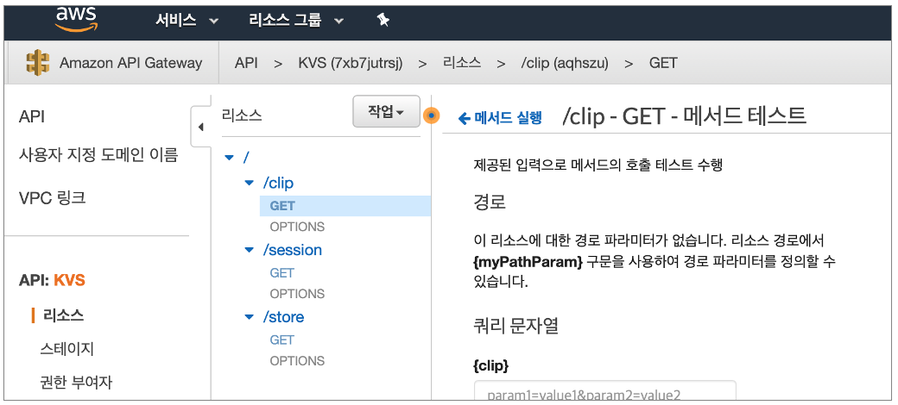
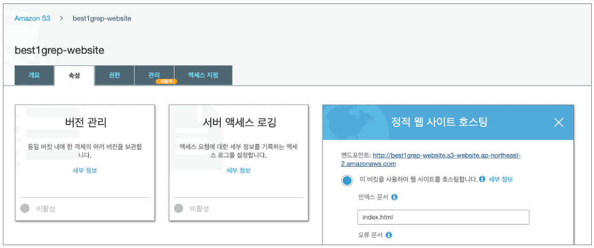
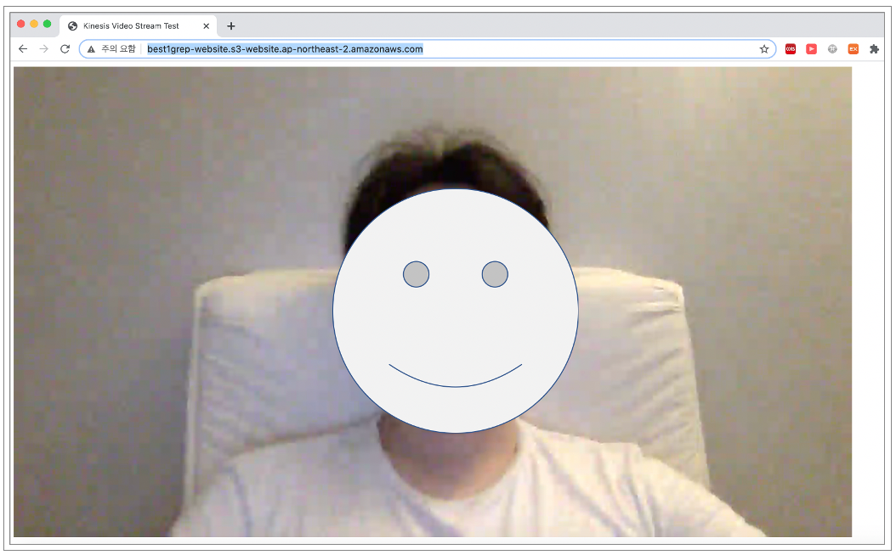
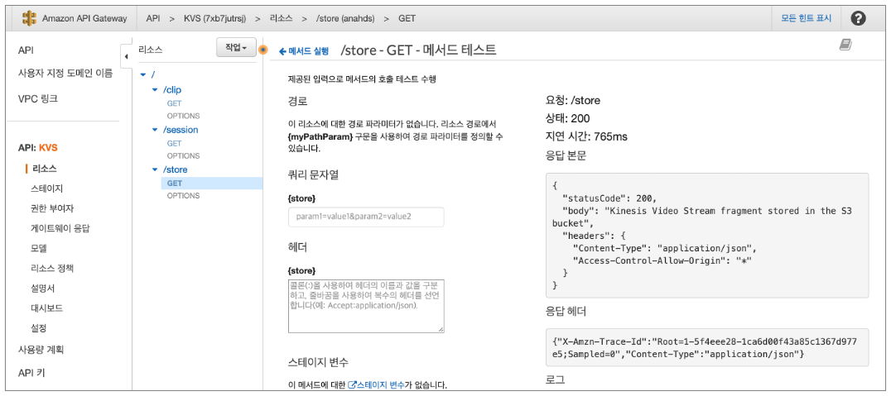
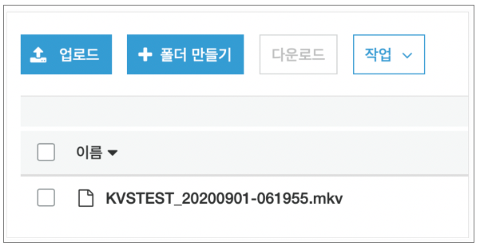
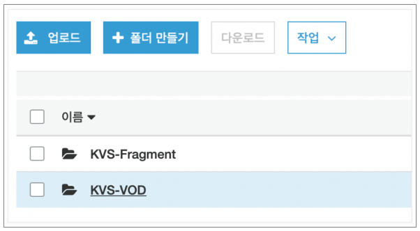
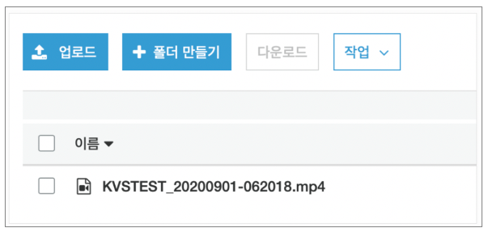

# AWS KinesisVideoStreams

* * *

### # KinesisVideoStreams - Serverless 테스트 구성 방안 ([1]~[3]) 

- [1] API-Gateway (/session) + Lambda1(실시간 KVS로 전송 중인 영상을 HLS URL로 재생 관련)
- [2] API-Gateway (/store) + Lambda2 (특정 시점 분석을 위해 잘 개 쪼개진 Fragment 영상을 S3에 저장 관련)
- [3] API-Gateway (/clip) + Lambda3 (특정 기간 동안의 MP4 VOD 영상을 S3에 저장 관련)

* * *

### # KinesisVideoStreams - 테스트 구성 고려 사항 

- [1] KinesisVideoStreams 1개 채널 기준으로 테스트 구성 (다수의 채널 처리 부분은 원하는 방향으로 개발 로직 구현 필요)
- [2] KinesisVideoStreams API TimestampRange 인자 값의 경우 테스트를 위한 특정 시점 기준으로 입력
- [3] Lambda에서 KVS 채널을 호출할 경우 동일한 리전에서 호출되어야 하는 제약사항 있음 (테스트 간 확인)

<br>

[준비] KinesisVideoStreams - API Syntax 참고 링크 
https://docs.aws.amazon.com/kinesisvideostreams/latest/dg/API_reader_ListFragments.html

[준비] KinesisVideoStreams - Serverless 구성 테스트 진행을 위한 API-Gateway 생성


* * *

### # KinesisVideoStreams - Serverless 테스트 구성 정리 ([1]~[3]) 

#### [1] API-Gateway (/session) + Lambda1(실시간 KVS로 전송 중인 영상을 HLS URL로 재생 관련)

##### 1-1. AWS API-Gateway 구성 (/session - GET)

##### 1-2. AWS Lambda Python 예제로 구성 (GET_HLS_STREAMING_SESSION_URL)

- get_hls_streaming_session_url() : 
https://boto3.amazonaws.com/v1/documentation/api/latest/reference/services/kinesis-video-archived-media.html#KinesisVideoArchivedMedia.Client.get_hls_streaming_session_url

```python
import os
import json
import boto3

def lambda_handler(event, context):
    # KinesisVideoStreams ARN
    streamarn = "arn:aws:kinesisvideo:ap-northeast-2:00000000000:stream/KVSTEST/1597742988841"

    kvs = boto3.client('kinesisvideo',region_name='ap-northeast-2')
    endpoint = kvs.get_data_endpoint(
            StreamARN = streamarn,
            APIName = 'GET_HLS_STREAMING_SESSION_URL'
        )

    kvam = boto3.client('kinesis-video-archived-media',endpoint_url = endpoint.get('DataEndpoint'))
    url = kvam.get_hls_streaming_session_url(
        StreamARN=streamarn,
        Expires=3600,
        PlaybackMode='LIVE'
    )

    headers = {'Content-Type' : 'application/json', 'Access-Control-Allow-Origin': '*'}
    res = {
        "statusCode" : 200,
        "body" : url.get('HLSStreamingSessionURL'),
        "headers" : headers
    }
    return res
```

##### 1-3. S3 정적 웹사이트 호스팅 구성 (index.html)



##### 1-4. S3 정적 웹사이트 호스팅 구성 (index.html - Video-js 플레이어 API-Gateway 호출)
```python
<html>

<head>
    <title>KinesisVideoStreams Test</title>
    <link href="https://vjs.zencdn.net/7.4.1/video-js.css" rel="stylesheet">
</head>

<body>
    <video-js id=example-video width=1280 height=720 class="vjs-default-skin" controls />
    <script src="https://vjs.zencdn.net/7.4.1/video.js"></script>
    <script>
        var player = videojs('example-video');
        var request = new XMLHttpRequest();
        request.open('GET', 'https://7xb7jutrsj.execute-api.ap-northeast-2.amazonaws.com/v1/session', true);
        request.responseType = 'text';
        request.onload = function () {
            var responseBody = JSON.parse(this.response);
            player.src({
                src: responseBody.body,
                type: "application/x-mpegURL"
            });
        }
        request.send();
        player.play();
    </script>
</body>

</html>
```

##### 1-5. API-Gateway 호출 테스트 결과 (/session - GET)


##### 1-6. S3 정적 웹사이트 호스팅 - KVS GET_HLS_STREAMING_SESSION_URL 재생 확인


* * *

#### [2] API-Gateway (/store) + Lambda2 (특정 시점 분석을 위해 잘 개 쪼개진 Fragment 영상을 S3에 저장 관련)

##### 2-1. AWS API-Gateway 구성 (/store - GET)

##### 2-2. AWS Lambda Python 예제로 구성 (GET_MEDIA_FOR_FRAGMENT_LIST)


- list_fragments() : 
https://boto3.amazonaws.com/v1/documentation/api/latest/reference/services/kinesis-video-archived-media.html#KinesisVideoArchivedMedia.Client.list_fragments

- get_media_for_fragment_list() :
https://boto3.amazonaws.com/v1/documentation/api/latest/reference/services/kinesis-video-archived-media.html#KinesisVideoArchivedMedia.Client.get_media_for_fragment_list

```python
import base64
import json
import boto3
import os
import datetime
import time
from botocore.exceptions import ClientError

def lambda_handler(event, context):

    # make sure to use the right ARN here:
    hls_stream_ARN = "arn:aws:kinesisvideo:ap-northeast-2:00000000000:stream/KVSTEST/1597742988841"
    STREAM_NAME = "KVSTEST"
    bucket='my-s3-bucket-kvs'
    print("Attempting to get an KVS fragment list from AWS LIST_FRAGMENTS Endpoint API...")


    # Get KVS LIST_FRAGMENTS Endpoint from GetDataEndpoint
    kvs = boto3.client("kinesisvideo")
    endpoint = kvs.get_data_endpoint(
        APIName="LIST_FRAGMENTS",
        StreamARN=hls_stream_ARN
    )['DataEndpoint']
    print("LIST_FRAGMENTS Endpoint : " + endpoint)


    # Get KVS fragment list 
    kvam = boto3.client("kinesis-video-archived-media", endpoint_url=endpoint)
    Fragment_list = kvam.list_fragments(
        StreamName=STREAM_NAME,
        MaxResults=123,
        FragmentSelector={
            'FragmentSelectorType': 'PRODUCER_TIMESTAMP',
            'TimestampRange': {
                'StartTimestamp': 1598927273,
                'EndTimestamp': 1598927274
            }
        }
    )['Fragments']
    print("Attempting to get an KVS fragment list")
    print(Fragment_list)

    Fragment_number = Fragment_list[0]['FragmentNumber']
    print("Fragment Number : " + Fragment_number)


    # Get KVS fragment and write .webm file and detection details to S3
    Fragment_stream = kvam.get_media_for_fragment_list(
        StreamName=STREAM_NAME,
        Fragments=[
            Fragment_number
        ]
    )
    base_key=STREAM_NAME+"_"+time.strftime("%Y%m%d-%H%M%S")
    mkv_key='KVS-Fragment/'+base_key+'.mkv'

    s3 = boto3.client('s3')
    s3.put_object(Bucket=bucket, Key=mkv_key, Body=Fragment_stream['Payload'].read())
    print("KinesisVideoStreams fragment stored in the S3 bucket")


    headers = {'Content-Type' : 'application/json', 'Access-Control-Allow-Origin': '*'}
    res = {
        "statusCode" : 200,
        "body" : "KinesisVideoStreams fragment stored in the S3 bucket",
        "headers" : headers
    }
    return res
```

##### 2-3. API-Gateway 호출 테스트 결과 (/store - GET)



##### 2-4. AWS CloudWatch Lambda 로그 확인


##### 2-5. AWS S3 저장 확인 (KVS-Fragment 폴더 내 *.mkv 저장)



* * *

#### [3] API-Gateway (/clip) + Lambda3 (특정 기간 동안의 MP4 VOD 영상을 S3에 저장 관련)

##### 3-1. AWS API-Gateway 구성 (/clip - GET)

##### 3-2. AWS Lambda Python 예제로 구성 (GET_CLIP)

- get_clip()
https://boto3.amazonaws.com/v1/documentation/api/latest/reference/services/kinesis-video-archived-media.html#KinesisVideoArchivedMedia.Client.get_clip

```Python
import base64
import json
import boto3
import os
import datetime
import time
from botocore.exceptions import ClientError

def lambda_handler(event, context):

    # make sure to use the right ARN here:
    hls_stream_ARN = "arn:aws:kinesisvideo:ap-northeast-2:00000000000:stream/KVSTEST/1597742988841"
    STREAM_NAME = "KVSTEST"
    bucket='my-s3-bucket-kvs'
    print("Attempting to get an KVS fragment list from AWS GET_CLIP Endpoint API...")


    # Get KVS GET_CLIP Endpoint from GetDataEndpoint
    kvs = boto3.client("kinesisvideo")
    endpoint = kvs.get_data_endpoint(
        APIName="GET_CLIP",
        StreamARN=hls_stream_ARN
    )['DataEndpoint']
    print("GET_CLIP Endpoint : " + endpoint)


    # Get KVS Stream GetClip
    kvam = boto3.client("kinesis-video-archived-media", endpoint_url=endpoint)
    Stream_GetClip = kvam.get_clip(
        StreamName=STREAM_NAME,
        ClipFragmentSelector={
            'FragmentSelectorType': 'PRODUCER_TIMESTAMP',
            'TimestampRange': {
                'StartTimestamp': 1598927273,
                'EndTimestamp': 1598927274
            }
        }
    )
    print("Attempting to get an KVS Stream GetClip")
    print(Stream_GetClip)


    # Get KVS fragment and write .mp4 file and detection details to S3
    base_key=STREAM_NAME+"_"+time.strftime("%Y%m%d-%H%M%S")
    mp4_key='KVS-VOD/'+base_key+'.mp4'

    s3 = boto3.client('s3')
    s3.put_object(Bucket=bucket, Key=mp4_key, Body=Stream_GetClip['Payload'].read())
    print("KinesisVideoStreams VOD Clip stored in the S3 bucket")


    headers = {'Content-Type' : 'application/json', 'Access-Control-Allow-Origin': '*'}
    res = {
        "statusCode" : 200,
        "body" : "KinesisVideoStreams VOD Clip stored stored in the S3 bucket",
        "headers" : headers
    }
    return res
```

##### 3-3. API-Gateway 호출 테스트 결과 (/clip - GET)


##### 3-4. AWS CloudWatch Lambda 로그 확인


3.5 AWS S3 저장 확인 (KVS-VOD 폴더 내 *.mp4 저장)



<br>

* * * 

<br>

#### AWS KinesisVideoStreams 테스트 참고 링크
- http://labs.brandi.co.kr/2018/07/31/kwakjs.html
- https://qiita.com/amachi0/items/03572471beb25bad9c8d
- https://www.alatortsev.com/aws-kinesis-video-streams/
- https://aws.amazon.com/ko/blogs/machine-learning/analyze-live-video-at-scale-in-real-time-using-amazon-kinesis-video-streams-and-amazon-sagemaker/


